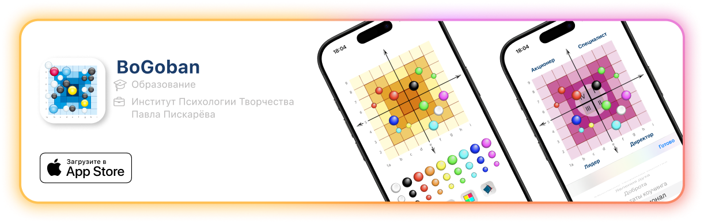
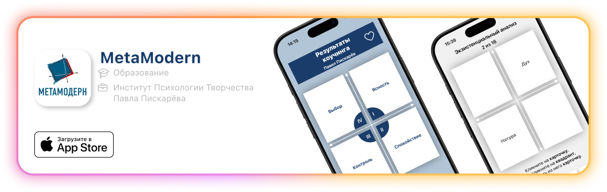

<h1>Hello There! 👋</h1>
<h2>I'm an iOS-Developer 🍃</h2>
I'm Alexander Pavlitskiy 🤓, known as <b>palexios</b> on the interviews. I've been devoted to Swift for more than 3 years now. What I love most is <b>designing the architecture</b> and <b>optimizing the data flow</b> to achieve the best performance and maintainability of my applications.

<h2>🧑‍🚀 My Tech Stack:</h2>

<table>
  <tr>
    <td>
      <ul>
        <li>Swift</li>
        <li>UIKit</li>
        <li>Combine</li>
        <li>Core Data</li>
        <li>Realm</li>
        <li>SwiftGen</li>
        <li>SnapKit</li>
      </ul>
    </td>
    <td>
      <ul>
        <li>Xcode</li>
        <li>Instruments</li>
        <li>Git</li>
        <li>GitHub</li>
        <li>Figma</li>
      </ul>
    </td>
    <td>
      <ul>
        <li>MVC</li>
        <li>MVVM</li>
        <li>MVVM-C</li>
      </ul>
    </td>
  </tr>
</table>
<h2>🚀 My Work Projects:</h2>

